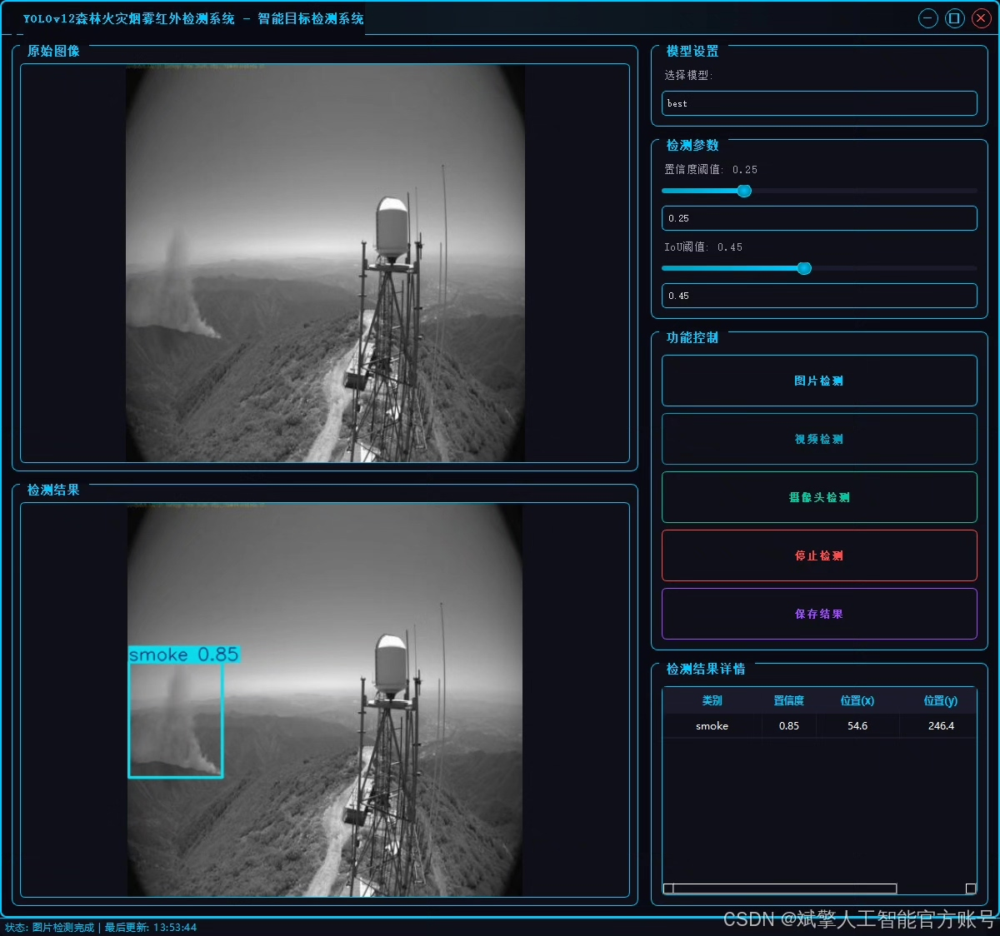
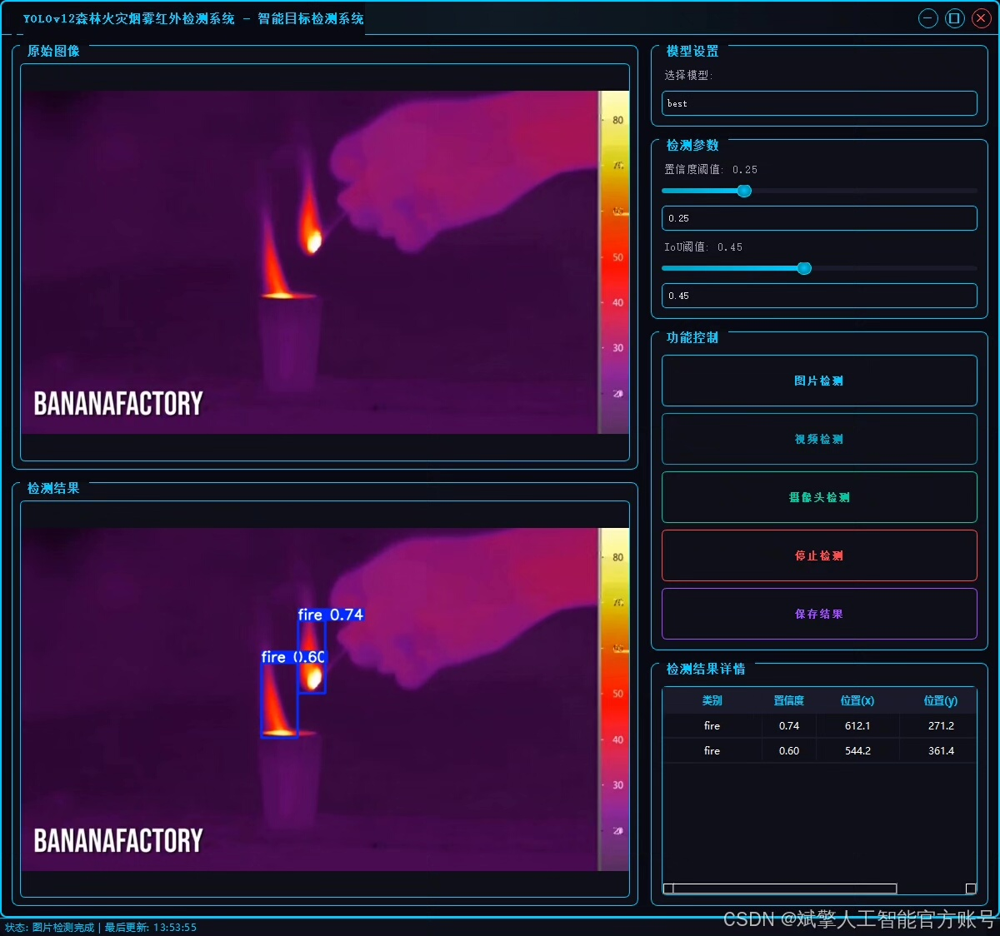
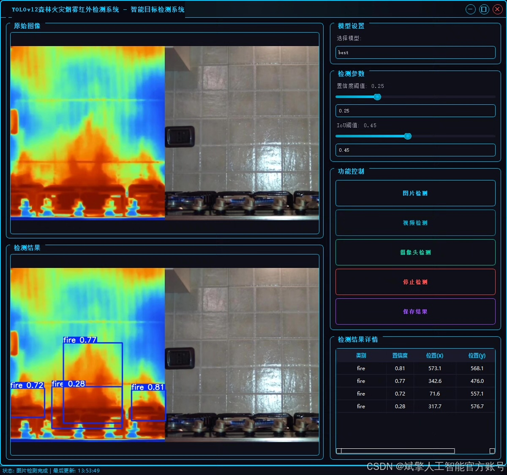
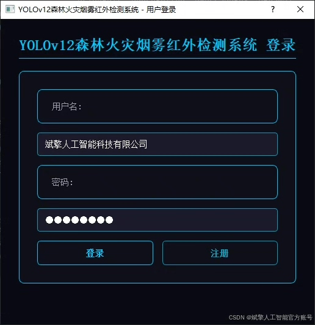
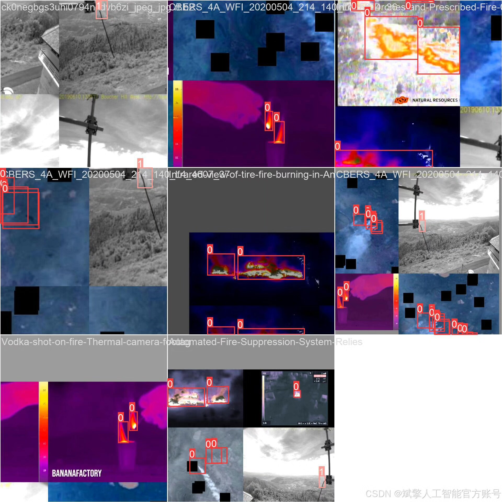
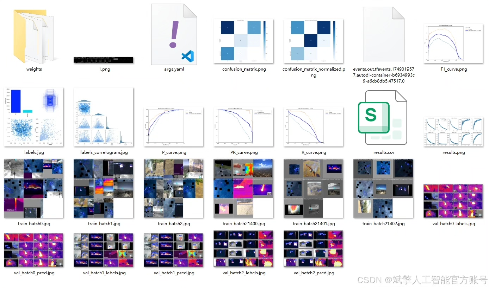
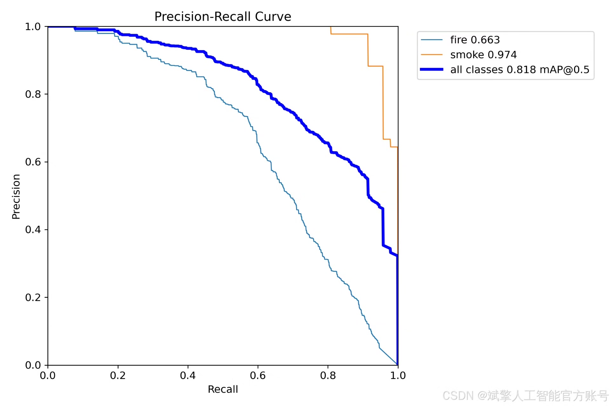
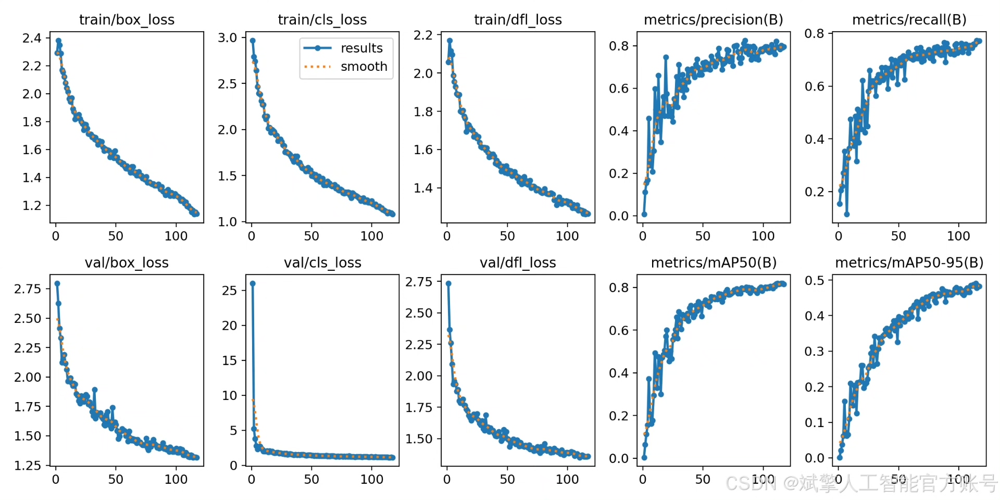
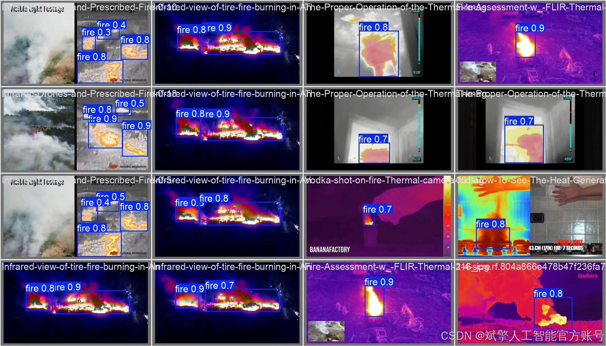

# YOLOv12 Forest Fire Detection System

## Body

YOLOv12 Forest Fire Detection System Based on Deep Learning YOLOv12 for Infrared Forest Fire Flame and Smoke Identification Detection System (YOLOv12+YOLO dataset + UI interface + login registration interface + Python project source code + model)

Forest fires are one of the important disasters that threaten ecological environment and human safety. Rapid and accurate fire detection is crucial for disaster prevention and control. This paper constructs a set of infrared forest fire flame and smoke detection systems based on the deep learning object detection algorithm YOLOv12. The system utilizes infrared image data to achieve high-precision real-time detection of flames (fire) and smoke (smoke) through the YOLOv12 model, with detection categories including two classes. The dataset includes 1600 training images, 200 validation images, and 200 test images, ensuring the generalization ability of the model. The system also integrates a user-friendly UI interface, supporting login registration functions. Experimental results show that the system can maintain a high detection accuracy and robustness even in complex environments, providing an effective technical solution for early warning of forest fires.

✅ User Login and Registration: Supports password verification and security authentication.
✅ Three detection modes: Based on the YOLOv12 model, supports image, video, and real-time camera detection, accurately identifying targets.
✅ Dual-screen comparison: Displays the original scene and detection results on the same screen.
✅ Data visualization: Real-time table displaying the category, confidence, and coordinates of detected targets.
✅ Intelligent parameter adjustment: Offers a confidence slide bar to dynamically optimize detection accuracy, adapting to different scene requirements.
✅ Sci-fi style interactive interface: Dark theme combined with dynamic light effects, reducing visual fatigue and improving operational experience.

## Images

## Payment

Here is a pay link on Stripe ( https://buy.stripe.com/3cs8yP7sY87d0vu9AB ). Please contact me lonlonago@foxmail.com after funding $89, and I will send you a complete data files , thank you!

